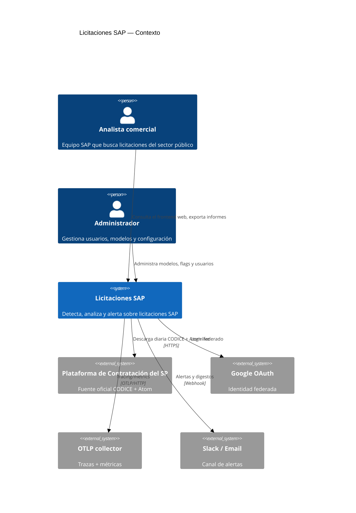
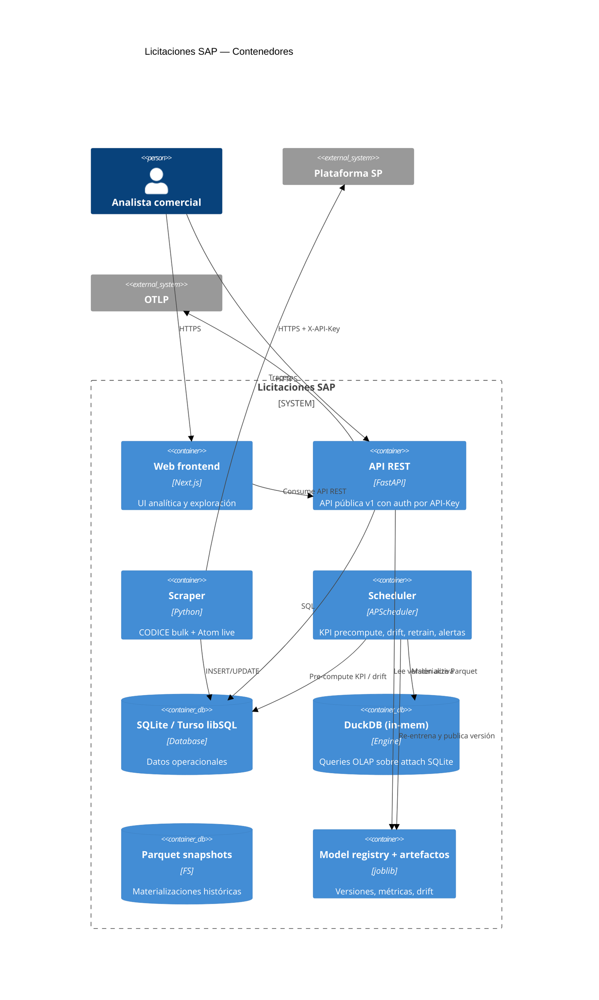
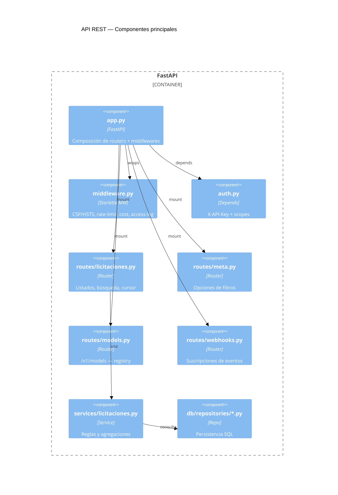

# Arquitectura C4 (Mermaid)

Diagramas C4 versionados según [c4model.com](https://c4model.com/). Tres
niveles: Contexto, Contenedores y Componentes.

> Renderiza en GitHub: los bloques ` ```mermaid ` se muestran nativos.

## C1 — Contexto



## C2 — Contenedores



## C3 — Componentes (API REST)



## Capas lógicas

La codebase se organiza en capas con dependencias unidireccionales:

```
web/        ──► api/
api/        ──► services/ ──► db/ + shared/
scheduler/  ──► services/      (dominio)    (persistencia + utilidades)
```

* `services/` contiene lógica de dominio pura (normalización,
  clasificación, threshold tuning, rate-limit). Sin dependencias UI.
  Ver [[ADR-007-services-domain-layer|ADR-007]].
* `shared/` aloja helpers transversales (auth core, signing, i18n,
  geo, schemas Pandera).
* `web/` consume la API REST y no accede a `services/` o `db/` directamente.

## Notas de mantenimiento

* Actualizar cuando se añada un contenedor (e.g. Redis, ClickHouse).
* Re-renderizar tras cambios estructurales mayores.
* Los componentes opcionales (Sentry, OpenTelemetry, DuckDB) se omiten
  para mantener legibilidad — documentados en ADRs separados.
