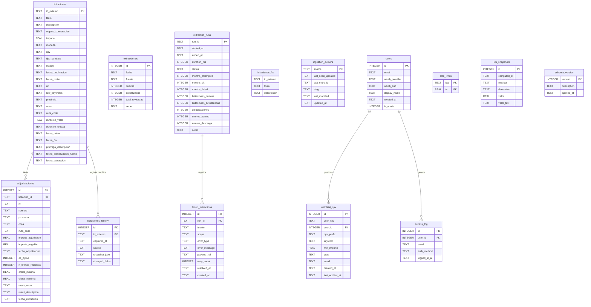

# Database Schema — TenderFlow

Documentación del esquema de base de datos del proyecto. El schema lógico
(tablas/columnas de este documento) es portable; el backend físico en
**producción es Postgres/Supabase** (psycopg3 + pool gestionado, ver
[ADR-016](adr/ADR-016-destino-persistencia-supabase.md)), con SQLite local o
Turso como alternativa de desarrollo/legacy. La abstracción de búsqueda
(`db/search_backend.py`) resuelve la diferencia FTS5 (SQLite) vs.
`tsvector`+GIN (Postgres) de forma transparente al código llamador. Las
migraciones canónicas viven en `db/alembic/`; `db/migrations.py` es el sistema
casero legacy (v1–v32), mantenido solo para BDs SQLite existentes.

---

## Diagrama ER



---

## Tablas

### `licitaciones` — Tabla principal

Almacena las licitaciones públicas relacionadas con SAP extraídas de PLACSP.

| Columna | Tipo | Descripción |
|---------|------|-------------|
| `id_externo` | TEXT PK | Identificador único de PLACSP (ContractFolderID) |
| `titulo` | TEXT | Título de la licitación (obligatorio) |
| `descripcion` | TEXT | Descripción detallada |
| `organo_contratacion` | TEXT | Nombre del órgano contratante |
| `importe` | REAL | Importe de licitación en EUR |
| `moneda` | TEXT | Código moneda (default: EUR) |
| `cpv` | TEXT | Código CPV (Common Procurement Vocabulary) |
| `tipo_contrato` | TEXT | Código de tipo de contrato (1=obras, 2=servicios, etc.) |
| `estado` | TEXT | Estado del expediente (PUB, EV, ADJ, RES, etc.) |
| `fecha_publicacion` | TEXT | Fecha de publicación ISO 8601 |
| `fecha_limite` | TEXT | Fecha límite de presentación ISO 8601 |
| `url` | TEXT | URL de la licitación en PLACSP |
| `raw_keywords` | TEXT | Keywords SAP detectadas (comma-separated) |
| `provincia` | TEXT | Provincia de ejecución |
| `ccaa` | TEXT | Comunidad Autónoma de ejecución |
| `nuts_code` | TEXT | Código NUTS3 de la región |
| `duracion_valor` | REAL | Duración numérica del contrato |
| `duracion_unidad` | TEXT | Unidad de duración (ANN/MON/DAY) |
| `fecha_inicio` | TEXT | Fecha de inicio de ejecución |
| `fecha_fin` | TEXT | Fecha de fin de ejecución |
| `prorroga_descripcion` | TEXT | Descripción de posibles prórrogas |
| `fecha_actualizacion_fuente` | TEXT | Timestamp `<updated>` del feed ATOM |
| `fecha_extraccion` | TEXT | Fecha de extracción por el scraper |

**Índices:**
- `idx_fecha_pub` — búsquedas y ordenación por fecha
- `idx_organo` — filtros por órgano contratante
- `idx_estado` — filtros por estado del expediente
- `idx_cpv` — búsquedas por código CPV
- `idx_ccaa` — filtros geográficos

---

### `adjudicaciones` — Adjudicatarios

Contiene los datos de adjudicación de cada licitación (empresa ganadora, importe, etc.).

| Columna | Tipo | Descripción |
|---------|------|-------------|
| `id` | INTEGER PK | Clave primaria autoincremental |
| `licitacion_id` | TEXT FK | Referencia a `licitaciones.id_externo` |
| `nif` | TEXT | NIF/CIF del adjudicatario |
| `nombre` | TEXT | Nombre de la empresa adjudicataria |
| `provincia` | TEXT | Provincia de la empresa |
| `ccaa` | TEXT | CCAA de la empresa |
| `nuts_code` | TEXT | Código NUTS3 de la empresa |
| `importe_adjudicado` | REAL | Importe final adjudicado |
| `importe_pagable` | REAL | Importe pagable (puede diferir del adjudicado) |
| `fecha_adjudicacion` | TEXT | Fecha de adjudicación |
| `es_pyme` | INTEGER | 1 si es PYME, 0 si no, NULL si desconocido |
| `n_ofertas_recibidas` | INTEGER | Número de ofertas presentadas |
| `oferta_minima` | REAL | Importe de la oferta más baja recibida |
| `oferta_maxima` | REAL | Importe de la oferta más alta recibida |
| `result_code` | TEXT | Código de resultado de la adjudicación |
| `result_description` | TEXT | Descripción del resultado |
| `fecha_extraccion` | TEXT | Fecha de extracción |

**Constraint único:** `(licitacion_id, nif, importe_adjudicado)` — evita duplicados.

---

### `extracciones` — Log de ejecuciones

Registro simplificado de cada ejecución del scraper.

| Columna | Tipo | Descripción |
|---------|------|-------------|
| `id` | INTEGER PK | Autoincremental |
| `fecha` | TEXT | Fecha/hora de la extracción (UTC) |
| `fuente` | TEXT | Identificador de la fuente (bulk_YYYYMM, place_live_atom) |
| `nuevas` | INTEGER | Licitaciones nuevas insertadas |
| `actualizadas` | INTEGER | Licitaciones actualizadas |
| `total_revisadas` | INTEGER | Total de entradas procesadas |
| `notas` | TEXT | Notas adicionales del run |

---

### `extraction_runs` — Métricas detalladas por run

Registro detallado de métricas de cada ejecución del pipeline (migración 1).

| Columna | Tipo | Descripción |
|---------|------|-------------|
| `run_id` | TEXT PK | UUID del run |
| `started_at` | TEXT | Inicio del run (ISO 8601 UTC) |
| `ended_at` | TEXT | Fin del run |
| `duration_ms` | INTEGER | Duración en milisegundos |
| `status` | TEXT | Estado: `running`, `ok`, `partial`, `error` |
| `months_attempted` | INTEGER | Meses intentados (bulk) |
| `months_ok` | INTEGER | Meses procesados sin error |
| `months_failed` | INTEGER | Meses con error |
| `licitaciones_nuevas` | INTEGER | Total nuevas en el run |
| `licitaciones_actualizadas` | INTEGER | Total actualizadas |
| `adjudicaciones` | INTEGER | Total adjudicaciones procesadas |
| `errores_parseo` | INTEGER | Errores de parseo XML |
| `errores_descarga` | INTEGER | Errores de descarga HTTP |
| `notas` | TEXT | Notas del run |

---

### `licitaciones_history` — Historial de cambios

Guarda snapshots del estado anterior cuando se detectan cambios en campos clave (migración 5).

| Columna | Tipo | Descripción |
|---------|------|-------------|
| `id` | INTEGER PK | Autoincremental |
| `id_externo` | TEXT FK | Referencia a la licitación |
| `captured_at` | TEXT | Timestamp en que se capturó el cambio |
| `source` | TEXT | Fuente que detectó el cambio (`bulk_*`, `place_live_atom`) |
| `snapshot_json` | TEXT | JSON con el estado **anterior** a los cambios |
| `changed_fields` | TEXT | Campos que cambiaron (comma-separated) |

**Campos tracked** (definidos en `config.HISTORY_TRACKED_FIELDS`):
`importe`, `estado`, `fecha_fin`, `fecha_inicio`, `duracion_valor`, `duracion_unidad`, `titulo`, `descripcion`

---

### `licitaciones_fts` — Índice de búsqueda full-text

Tabla virtual FTS5 para búsqueda full-text sobre títulos y descripciones (migración 7).

Sincronizada automáticamente con `licitaciones` vía triggers (`trg_fts_insert`, `trg_fts_delete`, `trg_fts_update`).

---

### `ingestion_cursors` — Cursores de ingesta

Almacena el estado de paginación del feed ATOM en vivo (migración 5).

| Columna | Tipo | Descripción |
|---------|------|-------------|
| `source` | TEXT PK | Identificador de la fuente (e.g. `place_live_atom`) |
| `last_seen_updated` | TEXT | Timestamp del último entry procesado |
| `last_entry_id` | TEXT | ID del último entry procesado |
| `etag` | TEXT | ETag HTTP para validación de caché |
| `last_modified` | TEXT | Last-Modified HTTP |
| `updated_at` | TEXT | Cuándo se actualizó este cursor |

---

### `watchlist_cpv` — Watchlist de usuarios

Reglas de seguimiento personalizadas por usuario (migraciones 2, 3, 4, 8).

| Columna | Tipo | Descripción |
|---------|------|-------------|
| `id` | INTEGER PK | Autoincremental |
| `user_key` | TEXT | Clave de usuario (email o session key) |
| `user_id` | INTEGER FK | Referencia a `users.id` (opcional) |
| `cpv_prefix` | TEXT | Prefijo CPV a vigilar (e.g. `72`) |
| `keyword` | TEXT | Keyword adicional (opcional) |
| `min_importe` | REAL | Importe mínimo para notificar |
| `ccaa` | TEXT | CCAA filtro (opcional) |
| `email` | TEXT | Email de notificación |
| `created_at` | TEXT | Fecha de creación de la regla |
| `last_notified_at` | TEXT | Última vez que se envió notificación |

---

### `users` — Usuarios del frontend web

Usuarios registrados vía OAuth (migración 8).

| Columna | Tipo | Descripción |
|---------|------|-------------|
| `id` | INTEGER PK | Autoincremental |
| `email` | TEXT UNIQUE | Email del usuario |
| `oauth_provider` | TEXT | Proveedor OAuth (e.g. `google`) |
| `oauth_sub` | TEXT | Subject claim del token OAuth |
| `display_name` | TEXT | Nombre para mostrar |
| `created_at` | TEXT | Fecha de registro |
| `is_admin` | INTEGER | 1 si tiene permisos de admin (migración 10) |

---

### `access_log` — Log de accesos

Registro de cada inicio de sesión en el frontend web (migración 9).

| Columna | Tipo | Descripción |
|---------|------|-------------|
| `id` | INTEGER PK | Autoincremental |
| `user_id` | INTEGER FK | Referencia a `users.id` |
| `email` | TEXT | Email del usuario (desnormalizado) |
| `auth_method` | TEXT | Método: `password`, `oauth`, `oauth+password` |
| `logged_in_at` | TEXT | Timestamp del acceso |

---

### `failed_extractions` — Dead Letter Queue

Registro de entradas que fallaron durante la extracción para reintento (migración 1).

| Columna | Tipo | Descripción |
|---------|------|-------------|
| `id` | INTEGER PK | Autoincremental |
| `run_id` | TEXT FK | Run en que ocurrió el fallo |
| `fuente` | TEXT | Fuente donde ocurrió |
| `scope` | TEXT | Fase: `download`, `parse`, `persist_licitaciones`, etc. |
| `error_type` | TEXT | Tipo de excepción |
| `error_message` | TEXT | Mensaje de error |
| `payload_ref` | TEXT | Referencia al payload (nombre de fichero XML, id_externo, etc.) |
| `retry_count` | INTEGER | Número de reintentos |
| `resolved_at` | TEXT | Cuándo se resolvió (NULL si pendiente) |
| `created_at` | TEXT | Cuándo se registró el fallo |

**Índice único parcial:** `(fuente, scope, payload_ref) WHERE resolved_at IS NULL` — evita DLQ duplicados.

---

### `rate_limits` — Rate limiting persistente

Ventana deslizante de timestamps por clave para rate limiting anti-bruteforce (migración 12).

| Columna | Tipo | Descripción |
|---------|------|-------------|
| `key` | TEXT PK | Clave de la operación (e.g. `login_fail:sha256_session`) |
| `ts` | REAL PK | Timestamp UNIX del evento |

---

### `kpi_snapshots` — KPIs pre-calculados

Snapshots de métricas pre-calculadas para acelerar la carga del frontend web (migración 13).

| Columna | Tipo | Descripción |
|---------|------|-------------|
| `id` | INTEGER PK | Autoincremental |
| `computed_at` | TEXT | Timestamp de cálculo (ISO 8601 UTC) |
| `metrica` | TEXT | Nombre de la métrica (e.g. `total_licitaciones`) |
| `dimension` | TEXT | Dimensión (default: `global`, puede ser `ccaa`, etc.) |
| `valor` | REAL | Valor numérico de la métrica |
| `valor_text` | TEXT | Valor en JSON para métricas complejas (series, rankings) |

**Métricas disponibles:**
- `total_licitaciones` — total en BD
- `importe_total`, `importe_medio` — importes globales
- `n_organos`, `n_ccaa` — distintos
- `licitaciones_30d`, `licitaciones_30d_prev` — ventanas temporales
- `licitaciones_por_ccaa` — JSON con ranking por CCAA
- `licitaciones_por_estado` — JSON con conteo por estado
- `total_adjudicaciones`, `licitaciones_con_adj` — adjudicaciones
- `top10_adjudicatarios` — JSON con top 10 empresas
- `serie_mensual_24m` — JSON con serie histórica 24 meses

---

### `schema_version` — Control de migraciones

| Columna | Tipo | Descripción |
|---------|------|-------------|
| `version` | INTEGER PK | Número de versión |
| `description` | TEXT | Descripción de la migración |
| `applied_at` | TEXT | Fecha de aplicación (ISO 8601 UTC) |

---

## Flujo de datos

```
PLACSP (XML/ATOM)
      │
      ▼
scraper/bulk_downloader.py   ←── Descarga ZIPs mensuales
scraper/atom_live.py         ←── Feed ATOM en vivo (cada 4h)
      │
      ▼
scraper/codice_parser.py     ←── Parsea CODICE/UBL XML → Licitacion dataclass
      │
      ▼
scraper/filters.py           ←── Filtra por keywords SAP (+ ML classifier)
      │
      ├──── licitaciones ◄─────────── db/database.upsert_licitaciones_with_history()
      ├──── adjudicaciones ◄────────── db/database.replace_adjudicaciones()
      ├──── extracciones ◄─────────── db/database.log_extraccion()
      ├──── licitaciones_history ◄──── (automático si hay cambios)
      ├──── extraction_runs ◄────────── observability/metrics.record_run()
      ├──── data/metrics/scraper.prom ◄ observability/prometheus.instrument_run()
      └──── kpi_snapshots ◄──────────── scheduler/kpi_precompute.run_kpi_precompute()
                                         (job separado post-scraping)
      │
      ▼
api/routes/analytics.py      ←── Expone KPIs y agregados al frontend web
```

---

### `saved_filters` — Filtros guardados por usuario

Guarda configuraciones de filtros nombradas por usuario para recuperarlas luego (migración 16).

| Columna | Tipo | Descripción |
|---------|------|-------------|
| `id` | INTEGER PK | Autoincremental |
| `user_key` | TEXT | Clave de usuario |
| `name` | TEXT | Nombre del filtro guardado |
| `filters_json` | TEXT | JSON con los valores de los filtros |
| `created_at` | TEXT | Fecha de creación |

**Constraint único:** `(user_key, name)`.

---

### `notification_reads` — Lecturas de notificaciones

Registra qué notificaciones ha marcado como leídas cada usuario (migración 17).

| Columna | Tipo | Descripción |
|---------|------|-------------|
| `id` | INTEGER PK | Autoincremental |
| `user_key` | TEXT | Clave de usuario |
| `notification_id` | TEXT | ID de la notificación/licitación |
| `read_at` | TEXT | Timestamp de lectura |

---

### `pending_digests` — Colas de emails pendientes

Entradas de watchlist pendientes de enviar en el próximo ciclo de digest (migración 18).

| Columna | Tipo | Descripción |
|---------|------|-------------|
| `id` | INTEGER PK | Autoincremental |
| `user_key` | TEXT | Clave de usuario |
| `recipient_email` | TEXT | Email destinatario |
| `entry_id` | INTEGER | ID de la entrada watchlist que hizo match |
| `licitacion_id` | TEXT | ID de la licitación matcheada |
| `frequency` | TEXT | Frecuencia: `immediate`, `daily`, `weekly` |
| `matched_at` | TEXT | Cuándo se detectó el match |
| `sent` | INTEGER | 0 = pendiente, 1 = enviado |

---

### `audit_log` — Log de auditoría

Registro de acciones de usuarios para auditoría de seguridad (migración 18).

| Columna | Tipo | Descripción |
|---------|------|-------------|
| `id` | INTEGER PK | Autoincremental |
| `user_key` | TEXT | Clave de usuario |
| `session_hash` | TEXT | Hash de sesión (anonimizado) |
| `action` | TEXT | Acción realizada (e.g. `login`, `filter_save`, `export`) |
| `detail` | TEXT | Detalle adicional en formato libre |
| `created_at` | TEXT | Timestamp generado por SQLite (`strftime(...,'now')`) |

---

### `api_keys` — API Keys de acceso a la REST API

Almacena hashes (SHA-256) de las API Keys emitidas para la API REST (migración 19).
El token en bruto **nunca** se guarda — solo se usa para verificar cabecera `X-API-Key`.

| Columna | Tipo | Descripción |
|---------|------|-------------|
| `id` | INTEGER PK | Autoincremental |
| `key_hash` | TEXT UNIQUE | SHA-256 hex del token en bruto |
| `name` | TEXT | Nombre descriptivo de la clave (quién la usa) |
| `created_at` | TEXT | Fecha de creación |
| `last_used` | TEXT | Última vez que se usó (actualizado best-effort) |
| `is_active` | INTEGER | 1 = activa, 0 = revocada |

**Índice parcial:** `idx_api_keys_hash WHERE is_active = 1` — las claves revocadas no se buscan.

---

## Versiones del esquema

| Versión | Descripción | Reversible |
|---------|-------------|-----------|
| 1 | `extraction_runs` + `failed_extractions` | Sí |
| 2 | `watchlist_cpv` | Sí |
| 3 | `watchlist_cpv.last_notified_at` | No (ALTER TABLE) |
| 4 | `watchlist_cpv.email` | No (ALTER TABLE) |
| 5 | `ingestion_cursors` + `licitaciones_history` | Sí |
| 6 | Columnas extra en `licitaciones` (programático `_apply_v6_columns`) | No (ALTER TABLE) |
| 7 | FTS5 + triggers `trg_fts_*` (programático `_apply_v7_fts`) | Sí |
| 8 | `users` + `watchlist_cpv.user_id` (programático `_apply_v8_user_id`) | Sí |
| 9 | `access_log` | Sí |
| 10 | `users.is_admin` (programático `_apply_v10_is_admin`) | No (ALTER TABLE) |
| 11 | Índice único parcial en `failed_extractions` para dedup DLQ | Sí |
| 12 | `rate_limits` | Sí |
| 13 | `kpi_snapshots` | Sí |
| 14 | `licitaciones.tecnologia` + backfill SAP (programático `_apply_v14_tecnologia`) | No (ALTER TABLE) |
| 15 | `watchlist_cpv.frequency` (programático `_apply_v15_frequency`) | No (ALTER TABLE) |
| 16 | `saved_filters` | Sí |
| 17 | `notification_reads` | Sí |
| 18 | `pending_digests` + `audit_log` | Sí |
| 19 | `api_keys` (REST API key auth) | Sí |
| 20 | índices compuestos `(ccaa, fecha_publicacion)` y `(estado, fecha_publicacion)` | Sí |

> **Migraciones programáticas:** Las versiones 6, 7, 8, 10, 14 y 15 ejecutan código Python
> adicional después del SQL (ver `_apply_v*` en `db/migrations.py`). Esto es necesario cuando
> se requiere lógica condicional (`PRAGMA table_info`) o un rebuild de índice FTS5 que SQLite
> no permite declarativamente.
>
> **Nota sobre rollbacks:** Las migraciones que solo añaden columnas (ALTER TABLE ADD COLUMN)
> no son reversibles en SQLite < 3.35 sin reconstruir la tabla completa.
> Para revertir esas versiones, restaura desde un backup de la BD.

---

## Queries comunes

```sql
-- Licitaciones SAP de los últimos 30 días ordenadas por importe
SELECT titulo, importe, organo_contratacion, fecha_publicacion
FROM licitaciones
WHERE fecha_publicacion >= date('now', '-30 days')
ORDER BY importe DESC;

-- Top 10 empresas adjudicatarias por importe total
SELECT nombre, COUNT(*) as n, SUM(importe_adjudicado) as total
FROM adjudicaciones
WHERE importe_adjudicado IS NOT NULL
GROUP BY nombre
ORDER BY total DESC
LIMIT 10;

-- Licitaciones con cambios de importe registrados en historial
SELECT l.id_externo, l.titulo, h.captured_at, h.changed_fields
FROM licitaciones_history h
JOIN licitaciones l ON l.id_externo = h.id_externo
WHERE h.changed_fields LIKE '%importe%'
ORDER BY h.captured_at DESC;

-- Estado actual del esquema
SELECT version, description, applied_at
FROM schema_version
ORDER BY version;

-- Tasa de éxito de los últimos 10 runs
SELECT run_id, status, licitaciones_nuevas, duration_ms
FROM extraction_runs
ORDER BY started_at DESC
LIMIT 10;

-- KPIs pre-calculados más recientes
SELECT metrica, valor, valor_text, computed_at
FROM kpi_snapshots
WHERE computed_at = (SELECT MAX(computed_at) FROM kpi_snapshots)
ORDER BY metrica;
```
